# Architecture — spring-xpose

spring-xpose is a **Java Annotation Processor (APT)** that runs at compile time inside the Gradle/Maven build. It reads `@ExposeEntity` on JPA entity classes and writes six `.java` source files per entity into the build's annotation-processing output directory. Those files are compiled in the same build round as regular source, so no bytecode manipulation, no runtime reflection, no Spring proxies.

---

## Module layout

```
spring-xpose/
├── annotations/    Pure annotation definitions — zero runtime deps
├── processor/      APT entry point + generators + models — compile-time only
└── starter/        Spring Boot autoconfiguration + runtime support classes
```

Each module has a single responsibility and a deliberate dependency direction:

```
annotations  ←  processor  ←  (user's app at compile time)
                               ↑
                            starter  ←  (user's app at runtime)
```

- `annotations` depends on nothing.
- `processor` depends on `annotations`, `javapoet` (code generation), `auto-service` (service-loader registration), and the JPA/Jakarta annotation API (read-only at APT time).
- `starter` depends on Spring Boot, MapStruct runtime, and Jackson — it never depends on `processor`.

---

## Compile-time data flow

```
┌─────────────────────────────────────────────────────────────┐
│  javac / Gradle annotation-processing round                  │
│                                                              │
│  @Entity @ExposeEntity(...)                                  │
│  class Product { ... }                                       │
│          │                                                   │
│          ▼                                                   │
│  ExposeEntityProcessor.process()                             │
│          │                                                   │
│          ▼                                                   │
│  EntityModel.parse()  ←── reads TypeElement field mirrors   │
│          │                                                   │
│          ├──▶ RepositoryGenerator   → ProductRepository.java │
│          ├──▶ DtoGenerator          → ProductDto.java        │
│          ├──▶ RequestDtoGenerator   → ProductRequestDto.java │
│          ├──▶ MapperGenerator       → ProductMapper.java     │
│          ├──▶ RestControllerGenerator → ProductController.java│
│          └──▶ SecurityConfigurerGenerator → ProductSecurityConfigurer.java
│                                                              │
│  Generated files land in:                                    │
│  build/generated/sources/annotationProcessor/java/main/      │
│  <entity-package>.generated/                                 │
└─────────────────────────────────────────────────────────────┘
```

---

## Class diagram

```mermaid
classDiagram

    %% ── Annotation module ────────────────────────────────────────
    class ExposeEntity {
        +String path
        +Operation[] expose
        +RelationMode relationMode
        +AuthType authType
        +String[] roles
        +String[] readRoles
        +String[] writeRoles
        +String[] ignoredFields
        +boolean pageable
        +Class customMapper
    }
    class Operation {
        <<enumeration>>
        FIND_ALL
        FIND_BY_ID
        CREATE
        UPDATE
        DELETE
    }
    class AuthType {
        <<enumeration>>
        NONE
        BASIC
        OAUTH2
    }
    class RelationMode {
        <<enumeration>>
        IDS_FOR_LIST_OBJECT_FOR_SINGLE
        ALWAYS_IDS
        ALWAYS_OBJECT
    }
    ExposeEntity --> Operation
    ExposeEntity --> AuthType
    ExposeEntity --> RelationMode

    %% ── Processor module — model ─────────────────────────────────
    class EntityModel {
        +String entityClassName
        +String entitySimpleName
        +String packageName
        +String idFieldName
        +String idClassName
        +String basePath
        +List~FieldModel~ fields
        +List~RelationFieldModel~ relations
        +Set~Operation~ operations
        +RelationMode relationMode
        +AuthType authType
        +Set~String~ roles
        +Set~String~ readRoles
        +Set~String~ writeRoles
        +Set~String~ ignoredFields
        +String customMapperClassName
        +boolean pageable
        +String versionFieldName
        +parse(TypeElement, ProcessingEnvironment) EntityModel$
        +hasCustomMapper() boolean
        +hasVersion() boolean
    }
    class FieldModel {
        +String name
        +String typeName
        +boolean isId
        +List~AnnotationMirror~ validationAnnotations
    }
    class RelationFieldModel {
        +String name
        +String fieldType
        +String relationType  // "SINGLE" | "COLLECTION"
        +String relatedEntityType
    }
    EntityModel "1" *-- "many" FieldModel
    EntityModel "1" *-- "many" RelationFieldModel

    %% ── Processor module — entry point ──────────────────────────
    class ExposeEntityProcessor {
        +process(Set, RoundEnvironment) boolean
    }
    ExposeEntityProcessor ..> EntityModel : parses

    %% ── Processor module — generators ───────────────────────────
    class RepositoryGenerator {
        +generate(EntityModel)
    }
    class DtoGenerator {
        +generate(EntityModel)
    }
    class RequestDtoGenerator {
        +generate(EntityModel)
    }
    class MapperGenerator {
        +generate(EntityModel)
    }
    class RestControllerGenerator {
        +generate(EntityModel)
    }
    class SecurityConfigurerGenerator {
        +generate(EntityModel)
    }

    ExposeEntityProcessor --> RepositoryGenerator
    ExposeEntityProcessor --> DtoGenerator
    ExposeEntityProcessor --> RequestDtoGenerator
    ExposeEntityProcessor --> MapperGenerator
    ExposeEntityProcessor --> RestControllerGenerator
    ExposeEntityProcessor --> SecurityConfigurerGenerator

    %% ── Starter module — runtime ─────────────────────────────────
    class SpringXposeAutoConfiguration {
        +relationAwareSerializer() RelationAwareSerializer
        +springXposeExceptionHandler() SpringXposeExceptionHandler
    }
    class SpringXposeProperties {
        +String mode
        +String restBasePath
        +Api api
    }
    class RelationAwareSerializer {
        +serialize(Object, JsonGenerator, SerializerProvider)
    }
    class SerializationContext {
        <<ThreadLocal>>
        +set(Mode)
        +get() Mode
        +clear()
        +Mode LIST
        +Mode SINGLE
    }
    class SpringXposeExceptionHandler {
        +handleUnreadable()   400
        +handleValidation()   400
        +handleEntityNotFound() 422
        +handleConstraintViolation() 409
        +handleOptimisticLock() 409
    }

    SpringXposeAutoConfiguration --> RelationAwareSerializer
    SpringXposeAutoConfiguration --> SpringXposeExceptionHandler
    RelationAwareSerializer ..> SerializationContext : reads mode
```



---

## Runtime request lifecycle

```
HTTP GET /api/products
        │
        ▼
ProductController.findAll()
        │
        ├── SerializationContext.set(LIST)        // ThreadLocal flag
        ├── repository.findAll()                  // Spring Data JPA
        ├── mapper.toDtoList(entities)            // MapStruct (or custom)
        │       └── DtoGenerator rules applied:
        │             • SINGLE relations → <field>Id (Long)
        │             • COLLECTION relations → omitted
        └── SerializationContext.clear()
        │
        ▼
200 OK  List<ProductDto>

HTTP POST /api/products  { "name":"Laptop", "categoryId": 3 }
        │
        ▼
ProductController.create(@Valid ProductRequestDto)
        │   (bean validation runs here — 400 on failure)
        ├── mapper.toEntity(requestDto)           // scalar fields only
        ├── entityManager.getReference(Category, 3)  // FK proxy, no SELECT
        ├── entity.setCategory(proxy)
        ├── repository.save(entity)               // INSERT + FK check at flush
        └── mapper.toDto(saved)
        │
        ▼
201 Created  ProductDto
```

---

## Security filter chain

Each entity gets its own `SecurityFilterChain` bean, scoped by `securityMatcher` to `/api/<path>/**`. The chains are ordered between 100 and 999 (deterministic hash of entity name) so they don't conflict with each other or with user-defined chains.

```
AuthType.NONE   → permitAll()
AuthType.BASIC  → httpBasic()  + hasAnyRole(readRoles) / hasAnyRole(writeRoles)
AuthType.OAUTH2 → oauth2ResourceServer(jwt) + hasAnyRole(readRoles) / hasAnyRole(writeRoles)
```

Read operations (GET) and write operations (POST / PUT / DELETE) can carry different role sets via `readRoles` and `writeRoles`.

---

## Key design decisions

| Decision | Rationale |
|---|---|
| Source-time (APT) not runtime | Generated `.java` files are readable, debuggable, and have no startup cost |
| JavaPoet for code generation | Type-safe; avoids string-template fragility; handles imports automatically |
| `@AutoService` for processor registration | Eliminates `META-INF/services` boilerplate; works with Gradle and Maven |
| `EntityManager.getReference()` for relations | Returns a JPA proxy immediately (no SELECT); FK is validated at flush — avoids N+1 |
| ThreadLocal `SerializationContext` | Lets the controller tell the serializer whether to emit IDs or full objects per request without changing the entity graph |
| MapStruct `@MappingTarget updateEntity()` | Safe PUT: load the entity first, then overlay only the fields present in `RequestDto` — prevents blind field-nulling |
| RFC 9457 `ProblemDetail` responses | Consistent, machine-readable error envelope across all generated controllers |

